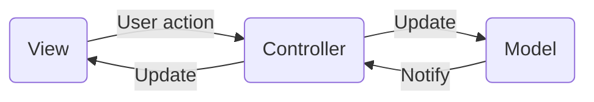

# AWS

# ToC

- [AWS](#aws)
- [ToC](#toc)
- [AWS Concepts](#aws-concepts)
  - [Certificates](#certificates)
  - [Global Infrastructure: AZ, Region...](#global-infrastructure-az-region)
  - [Misc](#misc)
  - [Create Instance](#create-instance)
- [Product Categories: Analytics](#product-categories-analytics)
- [Product Categories: Application Integration](#product-categories-application-integration)
- [Product Categories: Blockchain](#product-categories-blockchain)
- [Product Categories: Cloud Financial Management](#product-categories-cloud-financial-management)
- [Product Categories: Compute](#product-categories-compute)
  - [EC2 vs Lightsail](#ec2-vs-lightsail)
  - [Why Elastic Beanstalk?](#why-elastic-beanstalk)
- [Product Categories: Containers](#product-categories-containers)
- [Product Categories: Database](#product-categories-database)
  - [Aurora vs RDS](#aurora-vs-rds)
  - [ElastiCache](#elasticache)
- [Product Categories: Developer Tools](#product-categories-developer-tools)
- [Product Categories: End User Computing](#product-categories-end-user-computing)
- [Product Categories: Front-End Web & Mobile](#product-categories-front-end-web--mobile)
- [Product Categories: Internet of Things](#product-categories-internet-of-things)
- [Product Categories: Machine Learning](#product-categories-machine-learning)
- [Product Categories: Management & Governance](#product-categories-management--governance)
- [Product Categories: Media Services](#product-categories-media-services)
- [Product Categories: Migration & Transfer](#product-categories-migration--transfer)
- [Product Categories: Networking & Content Delivery](#product-categories-networking--content-delivery)
  - [ELB](#elb)
- [Product Categories: Quantum Technologies](#product-categories-quantum-technologies)
- [Product Categories: Robotics](#product-categories-robotics)
- [Product Categories: Satellite](#product-categories-satellite)
- [Product Categories: Security, Identity, & Compliance](#product-categories-security-identity--compliance)
  - [IAM](#iam)
  - [SSO](#sso)
- [Product Categories: Storage](#product-categories-storage)
  - [S3 vs EFS vs EBS](#s3-vs-efs-vs-ebs)
- [Product Categories: VR & AR](#product-categories-vr--ar)
- [Example Patterns](#example-patterns)
- [VPC](#vpc)
  - [AWS VPC: Features](#aws-vpc-features)
  - [AWS VPC: Keywords](#aws-vpc-keywords)
  - [AWS VPC Gateways](#aws-vpc-gateways)
  - [VPC: Route table is associated with...](#vpc-route-table-is-associated-with)
  - [VPC: Route Table](#vpc-route-table)
  - [VPC: Route Table Configs](#vpc-route-table-configs)
  - [AWS Products: MISC](#aws-products-misc)
  - [AWS: Account](#aws-account)
- [EC2](#ec2)
  - [Set up EC2: 1/2 Set up the key pair](#set-up-ec2-12-set-up-the-key-pair)
    - [Ref](#ref)
  - [Set up EC2: 2/2 Create the instance](#set-up-ec2-22-create-the-instance)
  - [EC2: Amazon Linux](#ec2-amazon-linux)
    - [Types](#types)
  - [EC2: AMI](#ec2-ami)
    - [Create](#create)
  - [EC2 Instance Types: Category](#ec2-instance-types-category)
  - [EC2: Instance Types](#ec2-instance-types)
  - [EC2: Connect to instance](#ec2-connect-to-instance)
  - [AWS VPC: Config Example 1](#aws-vpc-config-example-1)
  - [AWS VPC: Config Example 2](#aws-vpc-config-example-2)
- [Deploy Laravel to AWS](#deploy-laravel-to-aws)
  - [Use Elastic Beanstalk?](#use-elastic-beanstalk)
  - [Procedure w/ Elastic Beanstalk](#procedure-w-elastic-beanstalk)
    - [Ref](#ref-1)
  - [Procedure w/o Elastic Beanstalk](#procedure-wo-elastic-beanstalk)
  - [AWS + Laravel: References](#aws--laravel-references)
  - [AWS + Laravel: Overview](#aws--laravel-overview)
  - [MISC](#misc-1)
    - [What's phpMyAdmin?](#whats-phpmyadmin)
  - [Step 1/4 Set up the EC2 instance](#step-14-set-up-the-ec2-instance)
  - [Step 2/4 Set up the LAMP](#step-24-set-up-the-lamp)
  - [Step 3/4 Set up the RDS](#step-34-set-up-the-rds)
  - [Step 4/4 Ste up the Laravel App](#step-44-ste-up-the-laravel-app)
  - [masataka: Laravel + AWS Setup Procedure Overview](#masataka-laravel--aws-setup-procedure-overview)
  - [Installations of LAMP](#installations-of-lamp)
  - [masataka: configure file permissions on AWS](#masataka-configure-file-permissions-on-aws)
  - [atto: Laravel + AWS](#atto-laravel--aws)
  - [nakm: Laravel + AWS](#nakm-laravel--aws)
  - [Set up PHP](#set-up-php)
  - [Set up Apache](#set-up-apache)
  - [Set up Postgres](#set-up-postgres)
  - [Naka: Set up example](#naka-set-up-example)
    - [Ref](#ref-2)
    - [Set up procedure](#set-up-procedure)
  - [Naka: Overview](#naka-overview)
  - [Naka: Access Flow](#naka-access-flow)
    - [Redundant web server to the identical MySQL / Redis](#redundant-web-server-to-the-identical-mysql--redis)
    - [Re](#re)
  - [Naka: Subnets vs Subnet Group](#naka-subnets-vs-subnet-group)
  - [Naka: この構成でRedisはなんの役割をしているか？](#naka-この構成でredisはなんの役割をしているか)
  - [Naka: この構成でSecurityはどのように機能しているか？](#naka-この構成でsecurityはどのように機能しているか)
  - [Naka: この構成でもしWebサーバが落ちたらどうなるか？](#naka-この構成でもしwebサーバが落ちたらどうなるか)
  - [Naka: Security Group](#naka-security-group)
    - [w/o LB](#wo-lb)
    - [w/ LB](#w-lb)
- [Cloudfront](#cloudfront)
  - [w/o CloudFront](#wo-cloudfront)
  - [w/ CloudFront (then)](#w-cloudfront-then)
  - [w/ CloudFront (modern)](#w-cloudfront-modern)
  - [System Config Example](#system-config-example)

# AWS Concepts

## Certificates

SA (Solution Architect)

## Global Infrastructure: AZ, Region...

AZ (Availability Zone)
- A region has multiple AZ, that is, data centers
- A service can ber deployed to multiple AZs for redundancy
- Comm between multiple regions: High latency
- COmm between AZs inside the same region: Low latency
- For high availability: Multi-AZs with Active-Passive / Active-Active


Local Zone

Wavelength Zone

Direct Connect Location

Region
- "ap-northeast-1" is for Tokyo

## Misc

Pricing Calculator

SLA (Service Level Agreements): Amazon refunds when the availability is less than 95%

Subnet

## Create Instance

1. Choose AMI
2. Choose an instance type
3. Configure the instance details
4. Add tags
5. Set up Security group
6. Start

# Product Categories: Analytics

- ⭐️Athena
- Cloud Search
- EMR: for Hadoop
- FinSpace
- Kinesis
- MSK (Managed Streaming for Apache Kafka)
- ⭐️OpenSearch Service (formerly Elastisearch)
- ⭐️QuickSight
- ⭐️RedShift: Dataware House
- Data Exchange
- Data Pipeline
- Glue
- Lake Formation

# Product Categories: Application Integration

- AppFlow
- EverntBridge
- MWAA (Managed Workflows for APache Airflow)
- MQ
- SNS (Simple Notification Service)
- SQS (Simple Queue Service)
- Step Functions

# Product Categories: Blockchain

- Managed Blockchain
- QLDB (Quantum Ledger Database)

# Product Categories: Cloud Financial Management

1. Budegets
2. ⭐️Cost and Usage Report
3. ⭐️Cost Explorer
4. Saving Plans
5. Reserved Instance Report

# Product Categories: Compute

1. ⭐️⭐️⭐️EC2 (Elastic Compute Cloud)
2. EC2 Auto Scaling
3. ECS (duplicate)
4. EKS (duplicate)
5. Fargate (duplicate)
6. ⭐️Lightsail: Servers + Storage + DB + Networking. Cheap
7. App Runner
8. ⭐️⭐️⭐️Auto Scaling
9. Batch
10. Compute Optimizer
11. Elastic Beanstalk: PaaS for PHP, Node, Python, Docker... etc.
12. ⭐️⭐️⭐️Lambda: Run the code triggered by the events
13. Outposts
14. AWS Serverless Application Repository
15. Wavelength
16. VMWare Cloud on AWS

## EC2 vs Lightsail

|                 | EC2                            | Lightsail                                                                                                         |
| --------------- | ------------------------------ | ----------------------------------------------------------------------------------------------------------------- |
|                 | Compute                        | Compute, Storage, LB, Snapshot, Firewall, DNS, Networking                                                         |
| Cost            | Expensive, Calculated by usage | Cheap, Monthly Fixed Cost                                                                                         |
| Customizability | High                           | Low: Pre-configured (especially for LAMP, MEAN, Node.js), <br> however difficult to connect to other AWS services |
| Scalability     | High                           | Low                                                                                                               |
| Good for        | General App                    | Small Website, test env, WordPress                                                                                |

## Why Elastic Beanstalk?

Automatically configure the programming language-specific env; e.g. PHP, Laravel

Automatically configure the necessary AWS services:

- EC2 Instance
- Auto Scaling Group
- Load Balancer
- CloudWatch

- EC2 instance which is related to EB can't be stopped, seemingly
- EB service can't be halted; it must be terminated not to consume AWS resources.

# Product Categories: Containers

1. ⭐️ECS (Elastic Container Service)
2. ⭐️EKS (Elastic Kubernetes Service)
3. ⭐️Fargate: Manage EC2 instances for ECS / EKS instead of you
4. ECR (Elastic Container Registry) Docker images repository
5. App2Container
6. Copilot
7. Red Hat OpenShift Service on AWS

# Product Categories: Database

1. ⭐️⭐️⭐️Aurora: for MySQL & Postgres only
2. DocumentDB: MongoDB-like No-SQL engine
3. ⭐️⭐️⭐️RDS (Relational Database Service)
4. RDS on VMware
5. ⭐️DynamoDB: Key-value No-SQL database
6. ElastiCache
7. Keyspaces
8. MemoryDB for Redis
9. Neptune
10. RedShift(duplicate)
11. Timestream

## Aurora vs RDS

|              | Aurora                   | RDS     |
| ------------ | ------------------------ | ------- |
| DB           | MySQL, Postgres          |         |
| Speed        | 5x (MySQL), 3x(Postgres) | 1x      |
| Cost         |                          | Cheaper |
| Availability |                          |         |
| Scalability  |                          |         |
|              |                          |         |

## ElastiCache

Engine

- Redis
- Memcached

Purpose

- Data which will be accessed frequently
- Data which won't be updated frequently
- **session**, **DB cache**, etc.

# Product Categories: Developer Tools

# Product Categories: End User Computing

# Product Categories: Front-End Web & Mobile

- API Gateway (duplicate)
- Location Service
- Pinpoint
- SES (Simple Email Service)
- ⭐️Amplify
- AppSync
- Devise Farm

# Product Categories: Internet of Things

# Product Categories: Machine Learning

1. Augmented AI
2. 1. CodeGuru
3. Comprehend
4. DevOps Guru
5. Elastic Inference
6. Forecast
7. Fraud Detector
8. HealthLake
9. Kendra
10. Lex
11. Lookout for Equipment
12. Lookout for Metrics
13. Lookout for Vision
14. Monitron
15. Personalize
16. Polly
17. Rekognition
18. ⭐️SageMaker
19. SageMaker Ground Truth
20. Textract
21. Transcribe
22. Translate
23. Apache MXNet on AWS
24. Deep Learning AMIs
25. Deep Learning Containers
26. DeepComposer
27. DeepLens
28. DeepRacer
29. Inferentia
30. Panorama
31. PyTorch on AWS
32. TensorFlow on AWS

# Product Categories: Management & Governance

1. ⭐️⭐️⭐️CloudWatch
2. Managed Grafana
3. Managed Service for Prometheus
4. Chatbot
5. ⭐️CloudFormation: Describe the AWS system config in JSON; sort of IaC?
6. CloudTrail
7. CLI
8. Compute Optimizer
9. Config
10. Control Tower
11. Distro for OpenTelemetry
12. Launch Wizard
13. License Manager
14. Managed Services
15. Management Console
16. Management Console Mobile Application
17. OpsWorks
18. ⭐️Organizations
19. Personal Health Dashboard
20. Proton
21. Resilence Hub
22. Service Catalog
23. Systems Manager
24. ⭐️Trusted Advisor
25. Well-Architected Tool

# Product Categories: Media Services

# Product Categories: Migration & Transfer

1. Application Discovery Service
2. DMS (Database Migration Service)
3. DataSync
4. Mainframe Modernization
5. Migration Hub
6. SMS (Server Migration Service)
7. Transfer Family
8. CloudEndure Migration
9. Migration Evaluetor (formerly TSO Logic)

# Product Categories: Networking & Content Delivery

- ⭐️API Gatewary
- ⭐️CloudFront: CDN service: Static / dynamic contents will be delivered from the nearest server to the user. high speed delivery with cache: streaming is possible
- Amazon Route 53: DNS service
- VPC
- App Mesh
- Cloud Map
- Cloud WAN (preview)
- Direct Connect
- Global Accelerator
- Private 5G
- PrivateLink
- Transit Gateway
- VPN
- ⭐️ELB (Elastic Load Balancing)

## ELB

- Application LB
- Network LB
- Classic LB

Why need ELB?

- ELB distributes the load to multiple servers
  - Smaller load to each server, higher usability
- ELB puts the server into a maintenance mode without stopping the entire service
  - Fault tolerent
- ELB monitors the health of the servers
- ELB manages the security group
  - You can get SSL certificate
- ELB scales according to traffic amount

Types of ELB

- Application Load Balancer
  - High-spec
  - Layer 7: distribute HTTP / HTTPS
  - Can deal with container / micro-services
- Network Load Balancer
  - Millions of requests per sec
  - Layer 4: distribute TCP / UDP / TLS traffics
- Classic Load Balancer
  - Layer 7 & Layer 4

# Product Categories: Quantum Technologies

# Product Categories: Robotics

# Product Categories: Satellite

# Product Categories: Security, Identity, & Compliance

1. ⭐️Cognito
2. Detective
3. GuardDuty
4. Inspector
5. Macie
6. Artifact
7. Audit Manager
8. Certificate Manager
9. CloudHSM
10. Directory Service
11. Firewall Manager
12. ⭐️⭐️⭐️IAM (Identity and Access Management)
13. Key Management Service
14. Network Firewall
15. Resource Access Manager
16. Secrets Manager
17. Security Hub
18. Shield
19. ⭐️SSO: Single Sign-On
20. WAF

## IAM



Account types in AWS
1. Root User: Don't use this account for daily tasks! Use the root user only to manage IAM user accounts. Mail Address + Password
2. IAM User: Must be attached to Policies to have any priviledge

User vs Role
-


Job Functions
1. Administrator
3. Billing
4. Data Scientist
5. ⭐️Developer Power User
6. Network Administrator
7. Read-only Acess
8. Security Auditor
9. Support User
10. System Administrator
11. View-only user


## SSO

ID Store User

# Product Categories: Storage

1. ⭐️⭐️⭐️EBS (Elastic Block Store) EC2 Block Storage Volumes
2. ⭐️EFS (Elastic File Systems)
3. FSx
4. S3 Glacier
5. ⭐️⭐️⭐️S3 (Simple Storage Service)
6. Backup
7. Snow Family
8. Storage Gateway
9. CloudEndure Disaster Recover

## S3 vs EFS vs EBS

EFS

- EFS is NFS (Network File System)
- OS からマウントできる。S3 は HTTPS 経由でアクセス
- EC2 にマウントできる（EBS と同じ）
- **複数の AZ にまたがる大量の EC2 Instance**から同時にアクセス可
- **expensive**

EBS

- EBS is Block Storage
- Mountable to EC2 (Same as EFS)
- **single AZ, single EC2 instance**
  - A EC2 instance can mount multiple EBSs, tho

S3

- Object Storage
- Multi-AZ
- **cheap**

# Product Categories: VR & AR

# Example Patterns


# VPC


## AWS VPC: Features

- VPC: Virtual Private Cloud
  - selection of your own IP address range
  - creation of subnets
  - configuration of route tables and network gateways
- Major combination
  - EBS (for permanet storage)
  - EC2 (for server software)
  - VPC (for network)
- A VPC can have multiple AZs


## AWS VPC: Keywords

- Subnet
  - Public Subnet
  - Private Subnet
- Route table
  - Define possible connections among internet / subnets
- Router
- VPC Peering
- Endpoints for S3
- Elastic IP
  - Reachable IPv4 address from the internet
  - After you get the Elastic IP, you must assign it to your EC2 instance
- Security Group
  - Firewall for each instance


## AWS VPC Gateways

- Virtual Private Gateway
  - GW between the private network (such as on-premise server) & VPC
- IGW: Internet Gateway
  - GW between the internet & VPC
  - Without this, instances can't have the global IP
- NGW: NAT gateway: Network Address Translation
  - GW between the internet & private subnet
  - Enable instances in the private subnet connect to internet / other AWS services
  - Disable the internet establish the connection to the instances
- API Gateway
- AWS Direct Connect


## VPC: Route table is associated with...

Routing table can be associated with various entities.

1. Subnet Route Table
1. Gateway Route Table
2. Local Gateway Route Table


## VPC: Route Table


## VPC: Route Table Configs

- Destination
- Target


## AWS Products: MISC

- AWS Athena
- Search S3 storage with queries
- AWS Glue
- Amazon SNS: Simple Notification Service
- Amazon SQS: Simple Query Service
- AWS Snowball


## AWS: Account

- IAM: Identity and Access Management
- Root Acount
- IAM User

---

# EC2


## Set up EC2: 1/2 Set up the key pair

1. Create the key pair on the AWS console for OpenSSH
   - https://docs.aws.amazon.com/AWSEC2/latest/UserGuide/ec2-key-pairs.html#having-ec2-create-your-key-pair
   - You can't connect to EC2 without local private key
2. Download the private key
   - On Ubuntu, you should put the `.pem` file to `~/.ssh` dir
3. Change the file permission
   - `chmod 400 my-key-pair.pem`

### Ref

- https://docs.aws.amazon.com/AWSEC2/latest/UserGuide/EC2_GetStarted.html
- https://docs.aws.amazon.com/AWSEC2/latest/UserGuide/get-set-up-for-amazon-ec2.html#create-a-base-security-group
- https://docs.aws.amazon.com/AWSEC2/latest/UserGuide/AccessingInstancesLinux.html


## Set up EC2: 2/2 Create the instance

1. Choose AMI
2. Choose instance type
3. Choose security group
   - In the inbound rules, allow access from `anywhere` with `HTTP` & `HTTPS`
4. Choose key pair
5. Launch
6. Connect with SSH
   - `ssh -i /path/my-key-pair.pem ec2-user@my-instance-IPv6-address`


## EC2: Amazon Linux

- Linux server OS of AWS
- Amazon Linux uses `yum` like Cent OS instead of `apt`

### Types

- Amazon Linux
- Amazon Linux 2
  - available as AMI


## EC2: AMI

- Amazon Machine Image provides the info required to launch an instance:
  - EBS snapshot(s)
  - Link to AWS account
  - Block device mapping which specifies the volumes to attach to the instance on launch

### Create

1. Create AMI
2. Register AMI
3. Launch AMI


## EC2 Instance Types: Category

- General Purpose: A, T, M
- Compute Optimized: C
- Memory Optimized: R, X, High Memory, z1d
- Accelerated Computing: P, Inf, G, F
- Storage Optimized: I, D, H


## EC2: Instance Types

- **t2.micro** is available for free tier
- Every instance can be Linux or Windows
- nano < micro < small < medium < large < xlarge < 2xlarge


## EC2: Connect to instance

- **SSH Client**
- EC2 Instance Connect
- AWS Systems Manager Session Manager
- PuTTY (Windows)


## AWS VPC: Config Example 1

- Internet -(IGW)- VPC > AZ (has Subnets)
  - IGW > Public Subnet > t2.micro Instance
  - IGW > Public Subnet > NGW > Private Subnet > DB


## AWS VPC: Config Example 2

- Internet - (ELB)
  - EC2 1 in AZ 1 -> RDS 1 -> RDS 2 (replicate of RDS 1)
  - EC2 2 in AZ 2 -> RDS 1 -> RDS 2 (replicate of RDS 1)

---

# Deploy Laravel to AWS


## Use Elastic Beanstalk?

- A. Use AWS Beanstalk
  - Beanstalk -> My Code
- B. Deploy the Laravel on the  EC2 directly
  - Install LAMP, Composer manually with SSH
  - Host Infra -> OS -> Application Server -> HTTP Server -> My Code


## Procedure w/ Elastic Beanstalk

1. Launch Elastic Beanstalk env
1. Bundle Laravel app into .zip
1. Upload & deploy .zip on EB console
1. Configure doc root path
1. Add DB Instance
1. Configure `/database.php`
1. Bundle & Deploy again

### Ref

- https://docs.aws.amazon.com/elasticbeanstalk/latest/dg/php-laravel-tutorial.html
- https://dev.classmethod.jp/articles/elastic-beanstalk-laravel-deploy/


## Procedure w/o Elastic Beanstalk

1. Create EC2 instance
2. Connect to EC2 with SSH
3. Install Apache, PHP, Postgres with `yum`
4. Start Apache, then configure file privileges
    - `sudo service httpd`
5. Install Composer
6. Git clone the Laravel project, and install dependencies
7. Configure MySQL & `.env`
8. Run file seeding


## AWS + Laravel: References

- [AWS EC2 Doc: LAMP](https://docs.aws.amazon.com/AWSEC2/latest/UserGuide/install-LAMP.html)
- [Qiita: LaravelをAWSのEC2へデプロイする手順](https://qiita.com/masataka715/items/6e46f1f5e53bdff6cd3d)
  - **This tutorial doesn't use RDS???**
- [Qiita: AWSのEC2を立ち上げてLaravelのログイン機能を動かすまで](https://qiita.com/atto/items/e1effd28c212c3829cb0)
- [Qiita: laravelをAWS EC2にデプロイする](https://qiita.com/nakm/items/0bcc6564538a0604b2ce)
- [Qiita: AWSでウェブアプリケーション環境構築](https://qiita.com/minato-naka/items/ddb5f5301f9f590cdcbf)
- https://varunver.wordpress.com/2016/06/03/centos-7-install-php-and-postgres/
  - install PHP, Postgres


## AWS + Laravel: Overview

1. Set up the EC2 Instance
   1. with Amazon Linux AMI (not Linux 2)
2. Set up LAMP: [AWS EC2 Doc: LAMP](https://docs.aws.amazon.com/AWSEC2/latest/UserGuide/install-LAMP.html)
   1. `yum install` dependencies
   2. Allow TCP access to the instance on the EC2 console
   3. Create the new user group, and let it access to `\var\www`
   4. `mysql_secure_installation`
   5. Install `phpMyAdmin`
   6. Change Apache document root to `/var/www/html`
3. Set up the RDS
   1. Create the subnet in the same VPC with EC2
   2. Create the route table
   3. Create the security group
   4. Choose engine
4. Set up the Laravle App
   1. Laravel: Install composer, `git clone`
   2. Laravel: Key generation, set `.env`
   3. Laravel: Migration & Seeding


## MISC

### What's phpMyAdmin?

- Deal with MySQL DB
- Manipulation of the data with GUI
- Importing the data from CSV


## Step 1/4 Set up the EC2 instance


## Step 2/4 Set up the LAMP


## Step 3/4 Set up the RDS


## Step 4/4 Ste up the Laravel App

```sh


```


## masataka: Laravel + AWS Setup Procedure Overview

1. SSH connect to EC2
2. Install PHP, Apache, MySQL
3. Configure permission of Apache
4. Install Composer
5. git clone existing Laravel project from GitHub
6. Configure
   1. Apache: `http.conf`
   2. File permission for `var/www`
   3. `php artisan key:generate`
   4. Laravel: `.env`
   5. MySQL: Add user
7. Migration & seeding

## Installations of LAMP


## masataka: configure file permissions on AWS

1. Add the user `ec2-user` to `apache` user group
2. Let the `apache` group own the `var/www`
2. Let the `apache` group write to the `var/www`


## atto: Laravel + AWS


1. Create EC2 Instance
2. SSH connect
3. Intall LAMP & `phpmyadmin`
4. Set up Apache
   1. `httpd.conf`
   2. `custom.conf`
   3. `php.ini`
5. File permissions
   1. Create `www` group, and let the `ec2-user` belong to it
   2. Let the `www` group own the `var/www`
6. Install PHP, composer
7. Create Laravel proj
8. Configure `custom.conf`
   1. Change Apache root
   2. Activate `.htaccess`
9.


## nakm: Laravel + AWS


1. Configure connection to RDS
   1. How?
2. SSH connect to EC2 instance
3. Install PHP
4. Install MySQL
5. Install Apache
6. Configure `.env`


## Set up PHP

- `sudo yum install php -y`


## Set up Apache

```sh
# install
sudo yum install -y httpd24

# start httpd
# http daemon runs in the backgroud of web server,
# and waits for incoming server requests
sudo service httpd start

# Add "apache" supplemental group to the user "ec2-user"
# -a "appends" anyone to a supplemental groups
# -G add supplemental groups
sudo usermod -a -G apache ec2-user

#
sudo chown -R ec2-user:apache /var/www

#
sudo chmod 2775 /var/www

find /var/www -type d -exec sudo chmod 2775 {} \;

find /var/www -type f -exec sudo chmod 0664 {} \;
```


## Set up Postgres

- `sudo yum install postgresql-server postgresql-contrib`
- `sudo yum install php-pgsql`: Connector of PHP & Postgres


## Naka: Set up example

### Ref

- Qiita AWSでウェブアプリケーション環境構築 https://qiita.com/minato-naka/items/ddb5f5301f9f590cdcbf

### Set up procedure

1. EC2
   1. VPC, IGW
   3. Subnet, Route Table
   4. EC2 instance, Security Group (for EC2)
   5. Apache
2. RDS
   1. php, git, composer
   2. Configure Apache
   3. Private subnet & Subnet group
   4. Security Group (for DB)
   5. MySQL
   6. Laravel
3. LB
   1. Set up a redundant server
   2. ALB
4. ElastiCache Redis
5. Jump Server


## Naka: Overview

- **IGW** (Entrance to VPC)
  - **ALB**
    - us-east-2a AZ
      - Public Subnet (routing table A)
        - **Web Server Instance 1** (sec group: laravel-sg-web)
      - Private Subnet (routing table B)
        - **RDS MySQL Instance 1** (sec group: laravel-sg-rds)
        - **Redis ElastiCache**
    - us-east-2b AZ
      - Public Subnet (routing table C)
        - **Web Server Instance 2** (sec group: laravel-sg-web)
      - Private Subnet (routing table D)
        - **RDS MySQL Instance 2** (sec group: laravel-sg-rds)


## Naka: Access Flow

### Redundant web server to the identical MySQL / Redis

- IGW -> ALB -> Web Server 1 -> MySQL 1 / Redis
- IGW -> ALB -> Web Server 2 -> MySQL 1 / Redis

### Re


## Naka: Subnets vs Subnet Group

- https://docs.aws.amazon.com/AmazonElastiCache/latest/red-ug/SubnetGroups.html


## Naka: この構成でRedisはなんの役割をしているか？


## Naka: この構成でSecurityはどのように機能しているか？


## Naka: この構成でもしWebサーバが落ちたらどうなるか？


## Naka: Security Group

### w/o LB

`laravel-sg-web` allows:

- SSH access from **my IP**
- HTTP access from **my IP**

This configuration works, however by-passing the access with LB is more secure

### w/ LB

`laravel-sg-web` allows:

- HTTP access from **ALB security group**
  - As you can see here, to specify the acceptable access source, you can use security group instead of IP


# Cloudfront


## w/o CloudFront

- Internet -> ELB -> EC2 -> RDS


## w/ CloudFront (then)

- Route 1: Internet -> ELB -> EC2 -> RDS
- Route 2: Internet -> CF -> S3


## w/ CloudFront (modern)

- `CF -> ELB (ALB) -> EC2 (Apache) -> RDS (MySQL)`
- For static contents: CF returns the contents from the cache
- For dynamic contents: CF do nothing, EC2 & RDS returns the contents


## System Config Example

- App
  - CloudFront -> S3 -> ALB -> Apache PHP Servers
- Storage
  - RDS MySQL
  - ElastiCache (Redis): セッション保存用
  - EFS (NFS: Network File Systemの一種)
- Management
  - CloudWatch
  - Lambda
